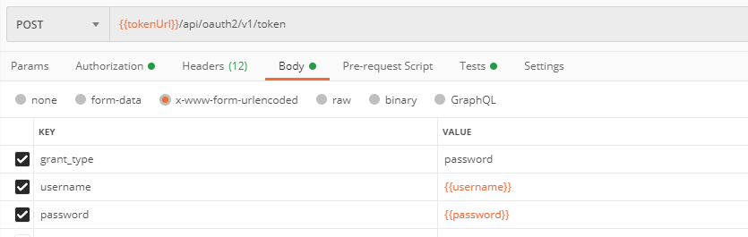

# Manage Extensions via API
## How to develop an extension app?
Follow extension development guide https://github.com/SAP-samples/fsm-extension-sample.
## How to add an extension app into FSM system via API calls
### 1. Prepare Postman collection.
1. Import [FSM-Extension-Catalog.postman_collection.json](../postman/FSM-Extension-Catalog.postman_collection.json) into your Postman app. 
2. Import [cloud-extension-catalog-service.postman_environment.json](../postman/cloud-extension-catalog-service.postman_environment.json) into your Postman app.  Update the following variables:  
    - serviceUrl (<https://<CLUSTER>.coresystems.net/cloud-extension-catalog-service/>. Replace <CLUSTER> with your specific FSM Cluster e.g. "eu", "de", "cn", "us", "au")
    - token (see section 3 how to fetch it)
    - account: the id of your account
    - company: the id of your company

>**NOTE:** You can find Account and Company IDs in the Admin Area in SAP Field Service Management (Sub-Areas: Account and Companies)

3. You can fetch token via **get token** API in the postman collection just like below screenshot.  

### 2. Add extension app.
#### Option 1 Automatic Deployment: Host your extension app in Kyma and Deploy your extension app via our extension installer.  
1. Provision Kyma and Set up connection between FSM and Kyma following [SAP Cloud Platform Extension Factory Integration](https://docs.coresystems.net/extensions-ui-plugins/cloud-platform-extension-factory-integration.html) guide.
2. Setup extension-installer for kyma, please refer to [https://github.com/SAP-samples/fsm-extension-installer-kyma](https://github.com/SAP-samples/fsm-extension-installer-kyma).
3. Open the POST **extensions** API request. Change the following information in the request body:
    1. name, description, version as you want.
    2. set deploymentType to "HELM_CHART".
    3. repository under artifactConfig/chart. The repository should be the root url of your repository which stored your deployment artifacts of your extension (make sure it is public and git based and your deployment artifacts are on the master branch).
    4. set hostingType to "KYMA".
4. Execute the request.
        **Request body example**
```
    {
        "lang": "en",
        "name": "demo-extension-app",
        "isActive": true,
        "description": "Demo Extension Application",
        "version": "0.0.1",
        "deploymentType": "HELM_CHART",
        "artifactConfig": {
            "chart": {
                "repository": "https://github.com/KakaWangSAP/kaka507"
            }
        },
        "icon": "https://zh.wikipedia.org/wiki/File:User_Circle.png",
        "hostingType": "KYMA"
    }
```
>**NOTE:** Please make sure to use *https://* for all resources in order have strict security enabled. (Non https-url might fail on installation or usage)**

5. Copy the id from the response body.
6. Open POST **extensions deploy** API request. Replace {id} in the url with the copied extension id. Normally you do not need to enter request body, the extension will be installed into default namespace of KYMA. If you want to install into other namespace, enter it in request body like below:

    **Request body example**
```
    {
        "deploymentConfig": {
            "namespace": "test-space"
        }
    }
```
7. Copy id value from response body.
#### Option 2 Manual Deployment: Host your extension app in any place by yourself and make sure it is accessible publicly.  
1. Open the POST **extensions** API request. Change the following information in the request body and then execute the request:  
    1. name, description, version as you want.  
    2. set deploymentType to "MANUAL_DEPLOYMENT".  
    3. set hostingType to "CUSTOM_HOSTING".  
    **Request body example**
```
    {
        "lang": "en",
        "name": "demo-extension-app",
        "isActive": true,
        "description": "Demo Extension Application",
        "version": "0.0.1",
        "deploymentType": "MANUAL_DEPLOYMENT",
        "icon": "https://zh.wikipedia.org/wiki/File:User_Circle.png",
        "hostingType": "CUSTOM_HOSTING"
    }
```
>**NOTE:** Please make sure to use *https://* for all resources in order have strict security enabled. (Non https-url might fail on installation or usage)**

2. Copy the extension id from the response body.
3. Open the POST **extension-deployments** API request. Replace {id} in the url with the copied extension id. Change accessUrl to the one which can access your extension app. Execute the request.  
    **Request body example**
```
    {
    	"version": "0.0.1",
    	"state": "INSTALLED",
        "accessUrl": "https://www.yourApp.com"
    }
```
>**NOTE:** Please make sure to use *https://* for all resources in order have strict security enabled. (Non https-url might fail on installation or usage)**
4. Copy extension deployment id value from response body.

### 3. Assign and use extension.

1. Open the POST **extension-assignments** API request. Set the target attribute to a unique value (this will later be used to add the specific extension into an outlet.). Replace extensionDeploymentId value with the one you get from above step.
Execute the request.  
    **Request body example**
```
    {
        "targetType": "OUTLET_POSITION",
        "target": "planning-3",
        "extensionDeploymentId": "10bc2af7-27b6-4864-bf8b-282ef30a838b"
    }
```
2. You extension should now be registered in FSM and can be [added to a Standard UI](https://docs.coresystems.net/shell/how-to-place-extensions.html). 

## Update and Delete app via API calls
### Update extension app
1. Open the PUT **extensions** API request to update the artifact information of an extension. Replace {id} in the url with your extension id, and update other fields in request body. Execute the request.  
    **Request body example**
```
    {
        "lang": "en",
        "name": "demo-extension-app",
        "isActive": true,
        "description": "Demo Extension Application",
        "version": "0.0.1",
        "deploymentType": "HELM_CHART",
        "artifactConfig": {
            "chart": {
                "repository": "https://github.com/KakaWangSAP/kaka507"
            }
        },
        "icon": "https://zh.wikipedia.org/wiki/File:User_Circle.png",
        "hostingType": "KYMA"
    }
```
2. Open the PATCH **extension-deployments** API request to partial update deployment information of an extension. Replace {id} in the url with your extension deployment id, and update other fields(only version, state, accessUrl, deploymentConfig can be updated) in request body. Execute the request.  
    **Request body example**
```
    {
        "version": "0.0.2",
        "state": "UPDATED"
    }
```
### Delete extension app
1. Open DELETE **extension-assignments** API to delete the assignment information of an extension. Replace {id} in the url with your extension assignment id. Execute the request.
2. Open DELETE **extension-deployments** API to delete the deploy information of an extension. Replace {id} in the url with your extension deployment id. Execute the request.
3. Open DELETE  **extensions** API to delete an extension. Replace {id} in the url with your extension id. Execute the request.
