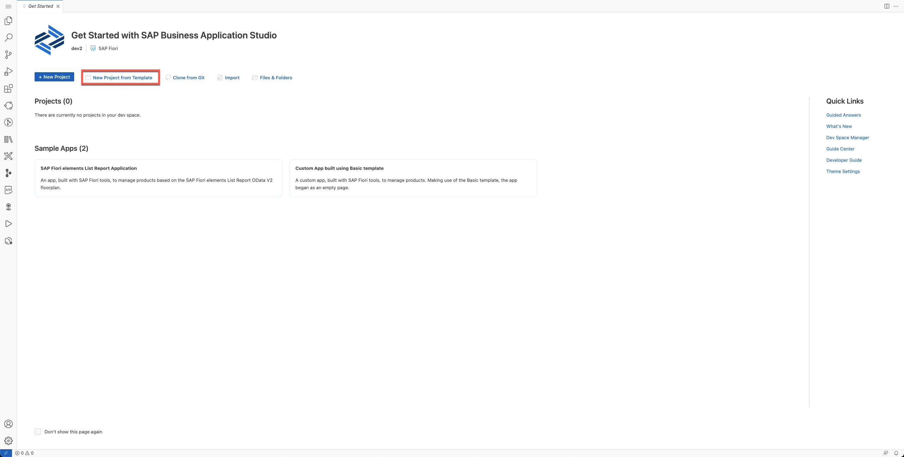
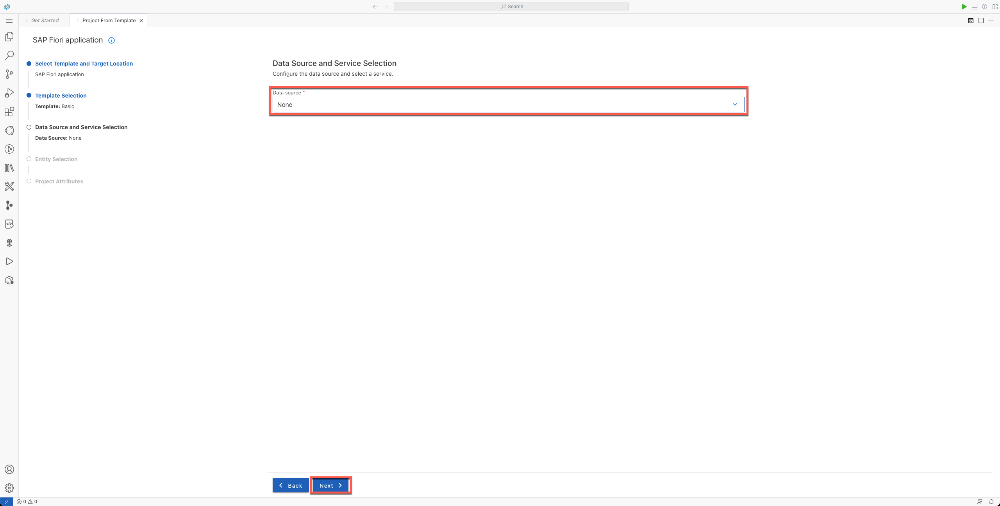
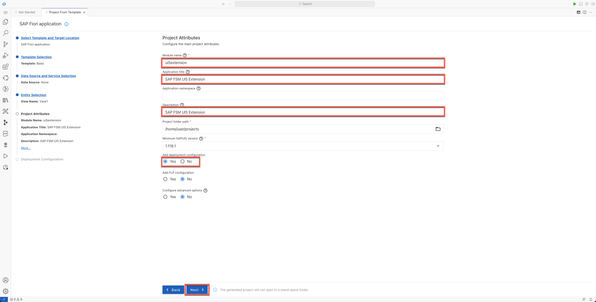
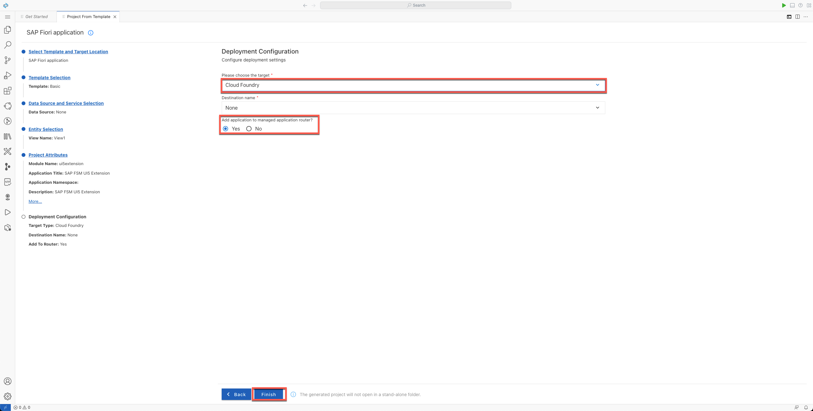
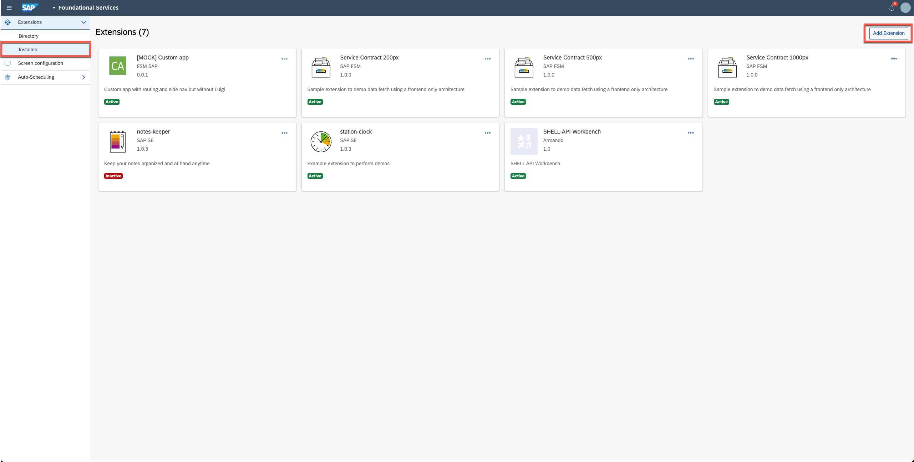
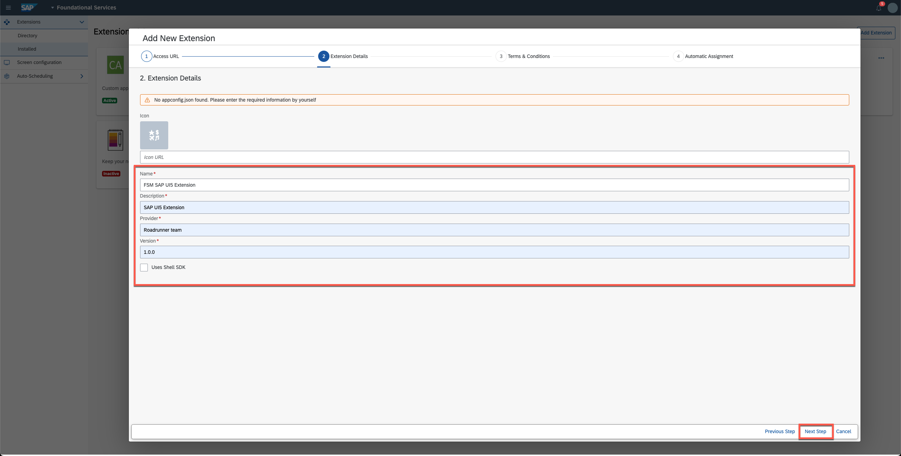

# Developing an Extension with SAPUI5 on SAP BTP Cloud Foundry

## Prerequisites

- **You have SAPUI5 development expertise:** Advanced skills are not required but a basic level would be very helpful. You can find a variety of resources on the **[Official Website](https://sapui5.hana.ondemand.com/)**.

- **You have an account on SAP Business Technology Platform (BTP):** If you don’t have an account, follow this **[tutorial](https://developers.sap.com/tutorials/hcp-create-trial-account.html)**.

- **You have knowledge about the new SAP Business Application Studio:** Check out the **[official documentation](https://help.sap.com/viewer/9d1db9835307451daa8c930fbd9ab264/Cloud/en-US)** or join the **[community](https://community.sap.com/topics/business-application-studio)**.

- **You have set up the SAP Business Application Studio for development:** If you have not set it up yet, follow this **[tutorial](https://developers.sap.com/tutorials/appstudio-onboarding.html)**.

- **You have a DEV space up and running.** If you have not created a DEV space yet, follow this **[tutorial](https://developers.sap.com/tutorials/appstudio-devspace-fiori-create.html)**.

## Step 1: Create a new SAP Fiori Application

- Choose **New project from template**:



- Select **SAP Fiori application** and choose **Next**:


- Select **Basic** from the list of templates and choose **Next**:


- Select **None** from the data source dropdown and choose **Next**:



- Leave the default view name and choose **Next**:


- Enter the module name, application title, description, and select **Yes** from the **Add deployment configuration** options. Then, choose **Next**:



- Select **Cloud Foundry** from target's dropdown and select **Yes** from the **Add application to managed application router"** options. Then, choose **Finish:**:



- In the workspace dialog box, choose **Add project to workspace**:


## Step 2: Consume the Shell SDK library

- To consume the shell SDK library from the SAPUI5 app, you need to load it during the start up of the app. For more information, see **[ShellSDK Examples](https://sap.github.io/fsm-shell/#/examples)**. Copy and paste the following code in the file ```/ui5extension/webapp/Component.js```:

```javascript
// Shell SDK library
sap.ui.loader.config({
    paths: {
        "sap/coresystems/fsm-shell": "https://unpkg.com/fsm-shell@1.5.1/release/fsm-shell-client"
    },
    shim: {
        "sap/coresystems/fsm-shell": {
            amd: true,
            exports: "FSMShell"
        }
    },
    async: true
});
```


- To establish a communication with the SAP Field Service Management Shell host, you need to initialize the client library and send a ```REQUIRE_CONTEXT``` event. For more information, see **[ShellSDK - Library usage sample](https://sap.github.io/fsm-shell/#/usage-sample?id=sending-event-to-the-shell-host-application)**. Copy and paste the following code in the file ```/ui5extension/webapp/controller/View1.controller.js```:

```javascript
sap.ui.define([
...
    "sap/coresystems/fsm-shell"
...

return Controller.extend("ui5extension.controller.View1", {
    onInit: function () {

        const { ShellSdk, SHELL_EVENTS } = FSMShell;

        const shellSdk = ShellSdk.init(parent, '*');

        shellSdk.emit(SHELL_EVENTS.Version1.REQUIRE_CONTEXT, {
            clientIdentifier: 'fsm-demo-plugin',
        });
    }
...
```


- To display some data pulled from SAP Field Service Management, let's change the template view generated within the project. Replace the content in the file ```/ui5extension/webapp/view/View1.view.xml``` with the following code:

```xml
<mvc:View controllerName="ui5extension.controller.View1"
    xmlns:mvc="sap.ui.core.mvc" displayBlock="true"
    xmlns="sap.m">
    <Page id="page" title="{i18n>title}">
        <content>
            <sap.ui.layout:Grid xmlns:sap.ui.layout="sap.ui.layout" id="grid0">
                <sap.ui.layout:content>
                    <ObjectListItem title="account" intro="Account" icon="sap-icon://account" id="account"/>
                    <ObjectListItem title="accountID" intro="Account ID" icon="sap-icon://account" id="accountID"/>
                    <ObjectListItem title="company" intro="Company" icon="sap-icon://factory" id="company"/>
                    <ObjectListItem title="companyID" intro="Company ID" icon="sap-icon://factory" id="companyID"/>
                    <ObjectListItem title="user" intro="User" icon="sap-icon://account" id="user"/>
                    <ObjectListItem title="userID" intro="User ID" icon="sap-icon://account" id="userID"/>
                    <ObjectListItem title="locale" intro="Selected Locale" icon="sap-icon://globe" id="selLocale"/>
                </sap.ui.layout:content>
            </sap.ui.layout:Grid>
        </content>
    </Page>
</mvc:View>
```


- Adjust the controller (```/ui5extension/webapp/controller/View1.controller.js```) adding the following code:

```javascript
...

return Controller.extend("ui5extension.controller.View1", {
    onInit: function () {
        const oView = this.getView();
...
...
            clientIdentifier: 'fsm-demo-plugin',
        });

        shellSdk.on(SHELL_EVENTS.Version1.REQUIRE_CONTEXT, (event) => {
            const {
                account,
                accountId,
                company,
                companyId,
                user,
                userId,
                selectedLocale,
            } = JSON.parse(event);

            oView.byId("account").setTitle(account);
            oView.byId("accountID").setTitle(accountId);
            oView.byId("company").setTitle(company);
            oView.byId("companyID").setTitle(companyId);
            oView.byId("user").setTitle(user);
            oView.byId("userID").setTitle(userId);
            oView.byId("selLocale").setTitle(selectedLocale);
        });
...
```


## Step 3: Build, Deploy, and Test the SAPUI5 Application

- To deploy the SAP UI5 app, you first need to build the project. Right click over the file ```./uiextension/mta.yaml``` and chose **"Build MTA"**.

- Wait until the building process is finished. The ```./ui5extension/dist``` and ```./ui5extension/mta_archives/``` folders should be created.

- Deploy the application by right clicking on the file ```./ui5extension/mta_archives/fsm-demo_0.0.1.mtar``` and chose **"Deploy MTA Archive"**.

- Wait until the deployment is finished.

- To test the SAPUI5 app in the browser, make sure you have created a subscription to the service **"SAP Build Work Zone, standard edition"** in the SAP BTP Cockpit:


- Click the application link:


## Step 4: Register the SAPUI5 Application as an extension in SAP Field Service Management

- Login to SAP Field Service Management and open the **Foundational Services** application, then navigate to **Extensions** > **Installed**, and choose **Add Extension**:



- Enter the URL of the SAPUI5 Application and choose **Next Step**:


- Enter name, description, provider, and a version for the extension. Then, choose **Next Step**:



- Agree to the **Terms & conditions**. Then, choose **Next Step**:


- Mark the **Automatic assignments** for the extension. Then, choose **Next Step**:


- While in **Extension Configuration** mode, navigate to **Planning and Dispatching > Dispatching Board** and choose **Add Extension**:


- Select the SAPUI5 extension and choose **Add**:


- The SAPUI5 should be loaded as an extension and displaying information from SAP Field Service Management:


