# How to develop an FSM extension with SAP UI5 in SAP BTP Cloud Foundry

## Prerequisites

- **You have experience developing SAP UI5 applications.** Advanced skills are not required but a basic level should be helpful. Many resources can be found on the **[Official Website](https://sapui5.hana.ondemand.com/)**.

- **You have an account on SAP BTP.** If you don't have it, follow this **[tutorial](https://developers.sap.com/tutorials/hcp-create-trial-account.html)** to create one.

- **You have knowledge about SAP Business Application Studio.** Check out the **[official documentation](https://help.sap.com/viewer/9d1db9835307451daa8c930fbd9ab264/Cloud/en-US)** or join the **[SAP community](https://community.sap.com/topics/business-application-studio)**.

- **You have set up SAP Business Application Studio for development.** If you haven't, follow this **[tutorial](https://developers.sap.com/tutorials/appstudio-onboarding.html)**.

- **You have a DEV space up and running.** If you have not created a DEV space yet, follow this **[tutorial](https://developers.sap.com/tutorials/appstudio-devspace-fiori-create.html)** to create one.

## Create a new SAP Fiori Application

- Click on **"New project from template"**.


- Select **"SAP Fiori application"** and click on the button **"Next"**.

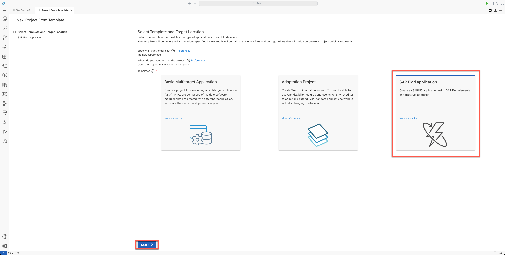

- Select **"Basic"** from the list of templates and click on the button **"Next"**.

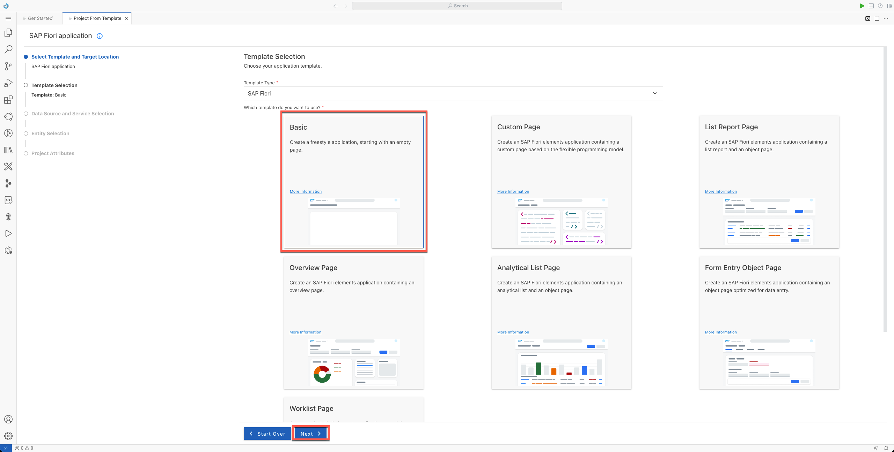

- Select **"None"** from the list of **"Data Source"** and click on the button **"Next"**.


- Leave the default view name and click on the button **"Next"**.

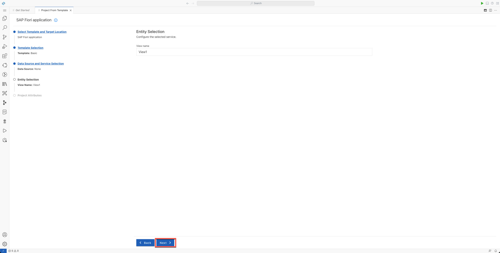

- Provide the **"Module name"**, **"Application title"**, **"Description"**, and **"Yes"** in the **"add deployment configuration"** selection. Then click on the button **"Next"**.


- Select **"Cloud Foundry"** from the list of **"targets"**, and the option **"Add application to managed application router"**. Then click on the button **"Finish"**.


- In the **"Workspace Dialog Box"**, select **"Add project to workspace"**

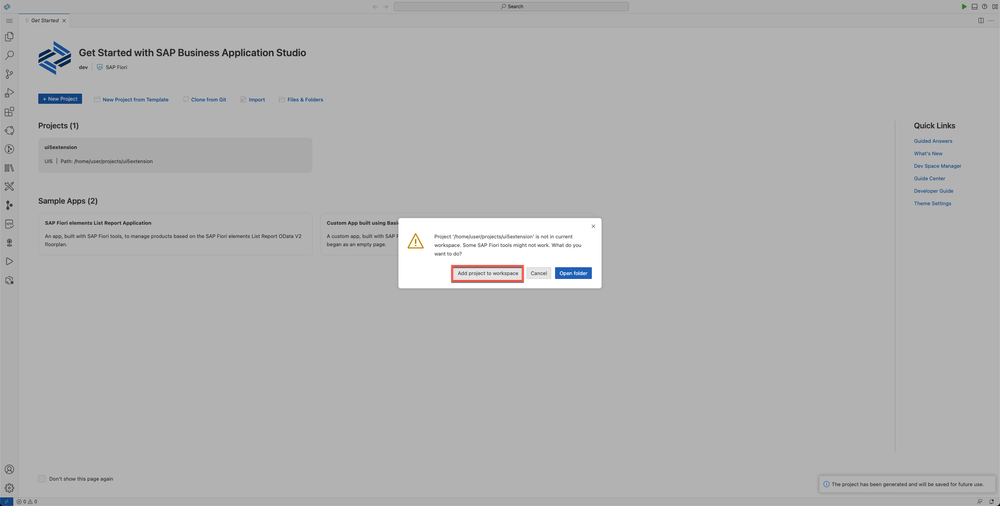

## Consuming the ShellSDK library

- Based on the **[official documentation](https://sap.github.io/fsm-shell/#/examples)**, to be able to consume the shellSDK library in the SAP UI5 app, we need to load it during the start up process. Copy and paste the following code in the file ```/ui5extension/webapp/Component.js```:

```javascript
// Shell SDK library
sap.ui.loader.config({
    paths: {
        "sap/coresystems/fsm-shell": "https://unpkg.com/fsm-shell@1.5.1/release/fsm-shell-client"
    },
    shim: {
        "sap/coresystems/fsm-shell": {
            amd: true,
            exports: "FSMShell"
        }
    },
    async: true
});
```


- In order to establish a communication with the FSM shell host, we need to initialize the client library and send a ```REQUIRE_CONTEXT``` event; as described **[here](https://sap.github.io/fsm-shell/#/usage-sample?id=sending-event-to-the-shell-host-application)**. Copy and paste the following code in the file ```/ui5extension/webapp/controller/View1.controller.js```:

```javascript
sap.ui.define([
...
    "sap/coresystems/fsm-shell"
...

return Controller.extend("sap.cp.ui5.controller.View1", {
    onInit: function () {

        const { ShellSdk, SHELL_EVENTS } = FSMShell;

        const shellSdk = ShellSdk.init(parent, '*');

        shellSdk.emit(SHELL_EVENTS.Version1.REQUIRE_CONTEXT, {
            clientIdentifier: 'fsm-demo-plugin',
        });
    }
...
```


- To display data from FSM, let's change the template view generated within the project. Replace the content in the file ```/ui5extension/webapp/view/View1.view.xml``` with the following code:

```xml
<mvc:View controllerName="ui5extension.controller.View1"
    xmlns:mvc="sap.ui.core.mvc" displayBlock="true"
    xmlns="sap.m">
    <Page id="page" title="{i18n>title}">
        <content>
            <sap.ui.layout:Grid xmlns:sap.ui.layout="sap.ui.layout" id="grid0">
                <sap.ui.layout:content>
                    <ObjectListItem title="account" intro="Account" icon="sap-icon://account" id="account"/>
                    <ObjectListItem title="accountID" intro="Account ID" icon="sap-icon://account" id="accountID"/>
                    <ObjectListItem title="company" intro="Company" icon="sap-icon://factory" id="company"/>
                    <ObjectListItem title="companyID" intro="Company ID" icon="sap-icon://factory" id="companyID"/>
                    <ObjectListItem title="user" intro="User" icon="sap-icon://account" id="user"/>
                    <ObjectListItem title="userID" intro="User ID" icon="sap-icon://account" id="userID"/>
                    <ObjectListItem title="locale" intro="Selected Locale" icon="sap-icon://globe" id="selLocale"/>
                </sap.ui.layout:content>
            </sap.ui.layout:Grid>
        </content>
    </Page>
</mvc:View>
```


- Now adjust the controller (```/ui5extension/webapp/controller/View1.controller.js```) adding the following code:

```javascript
...

return Controller.extend("sap.cp.ui5module.controller.View1", {
    onInit: function () {
        const oView = this.getView();
...
...
            clientIdentifier: 'fsm-demo-plugin',
        });

        shellSdk.on(SHELL_EVENTS.Version1.REQUIRE_CONTEXT, (event) => {
            const {
                account,
                accountId,
                company,
                companyId,
                user,
                userId,
                selectedLocale,
            } = JSON.parse(event);

            oView.byId("account").setTitle(account);
            oView.byId("accountID").setTitle(accountId);
            oView.byId("company").setTitle(company);
            oView.byId("companyID").setTitle(companyId);
            oView.byId("user").setTitle(user);
            oView.byId("userID").setTitle(userId);
            oView.byId("selLocale").setTitle(selectedLocale);
        });
...
```


## Building, deploying and testing the SAP UI5 app

- In order to deploy the SAP UI5 app, first we need to build the project. Right click over the file ```./uiextension/mta.yaml``` and click on the option **"Build MTA"**.

- Wait until the building process is finished. The ```./ui5extension/dist``` and ```./ui5extension/mta_archives/``` folders should be created.

- Deploy the application by right clicking on the file ```./ui5extension/mta_archives/fsm-demo_0.0.1.mtar``` and then on the option **"Deploy MTA Archive"**.

- Wait until the deployment is finished.

- To test the SAP UI5 app in the browser, make sure you have created a subscription to the service **"SAP Build Work Zone, standard edition"** in the SAP BTP Cockpit:


- Click on the application link:

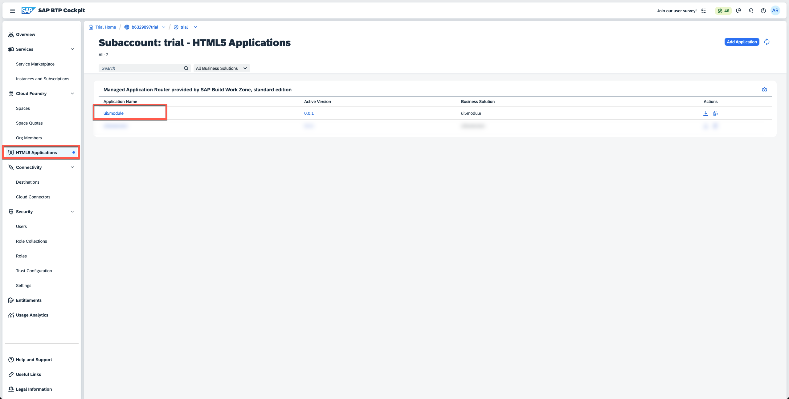

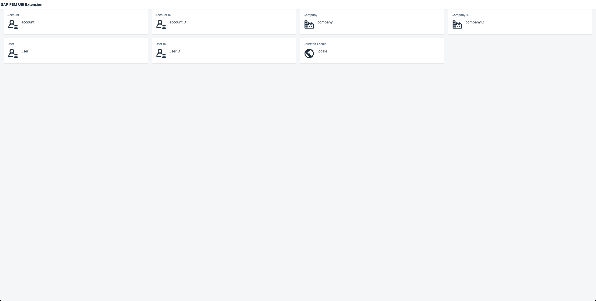

## Registering the SAP UI5 app as an FSM extension

- Login to the FSM Shell Application, navigate to **"Foundational Services"**, **"Extensions"**, **"Installed"** and click on the button **"Add Extension"**:


- Provide the URL of the SAP UI5 app and click on the button **"Next Step"**:

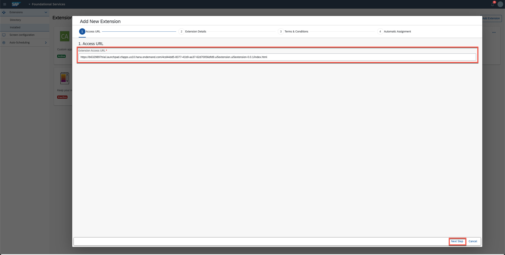

- Type in **"Name"**, **"Description"**, **"Provider"**, and a **"Version"** for the extension. Then click on the button **"Next Step"**:


- Agree to the **"Terms & conditions"**. Then click on the button **"Next Step"**:

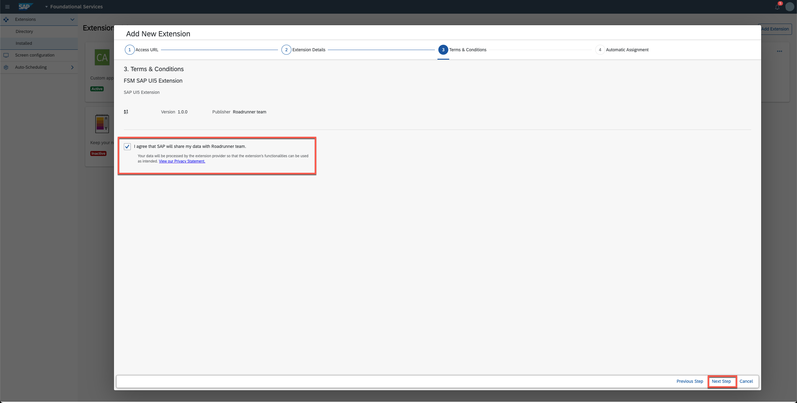

- Select the **"Automatic assignments"** for the extension, then click on the button **"Next Step"**:

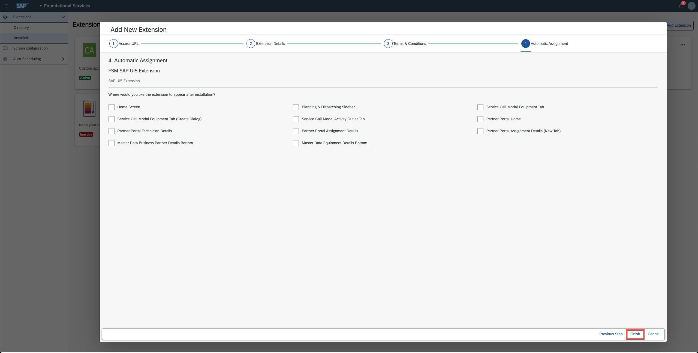

- While in **"Extension Configuration"** mode, navigate to **"Planning and Dispatching"**, **"Dispatching Board"** and click on the **"Add Extension"** button.

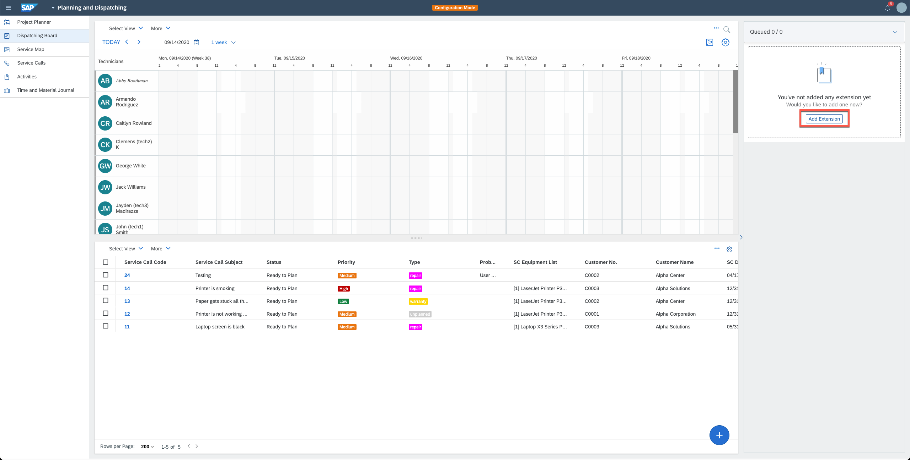

- Select the SAP UI5 extension and click on the button **"Add"**:

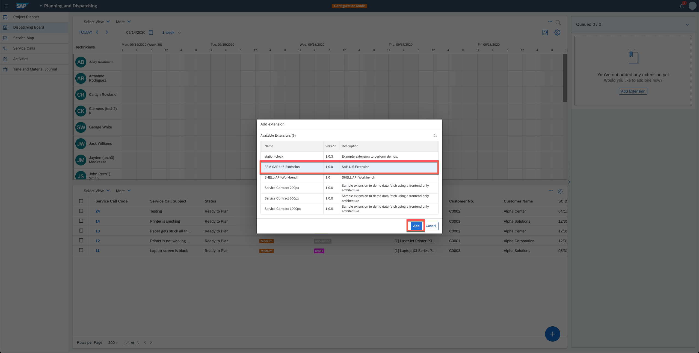

- The SAP UI5 is loaded as an extension and displaying information from FSM:

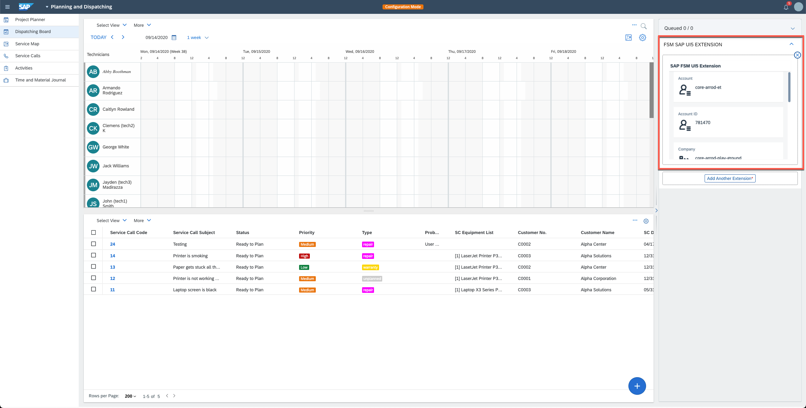
